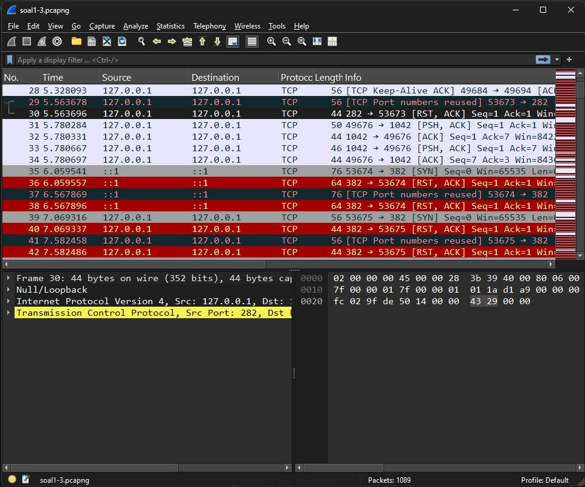
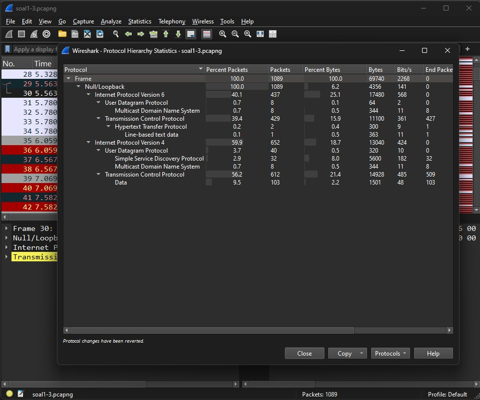
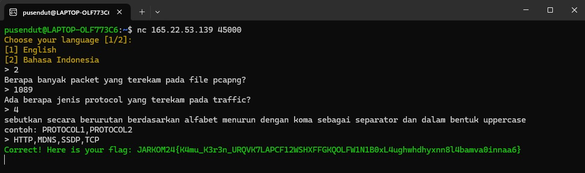
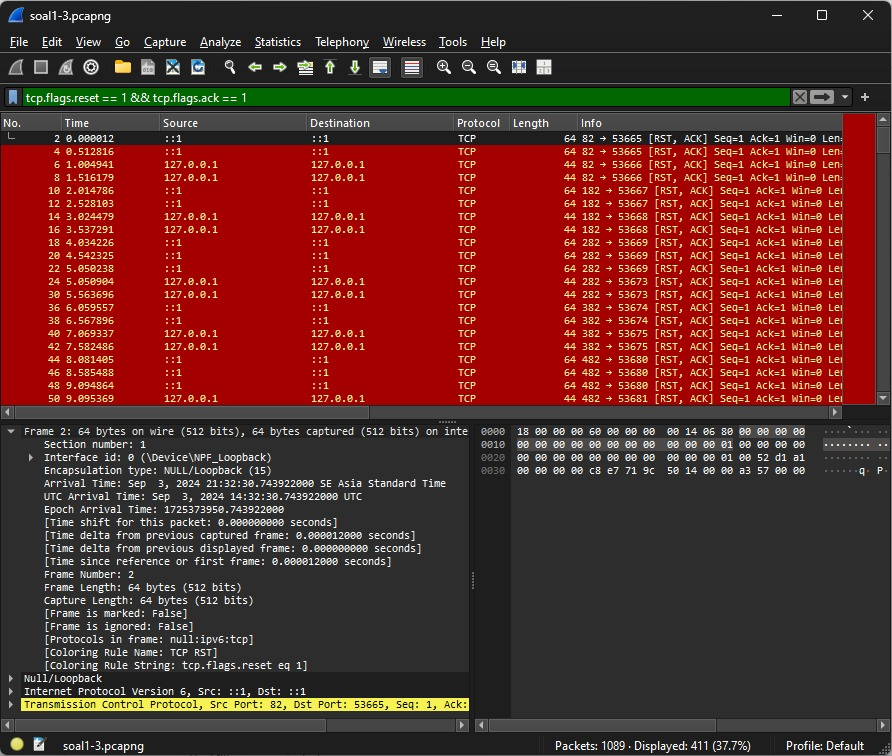
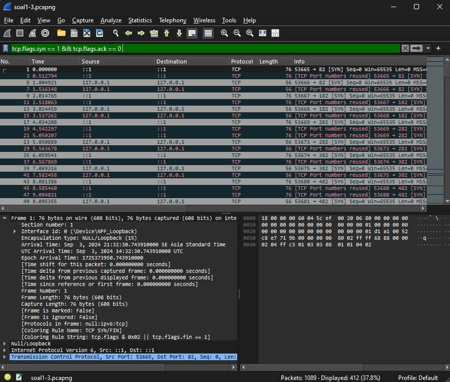
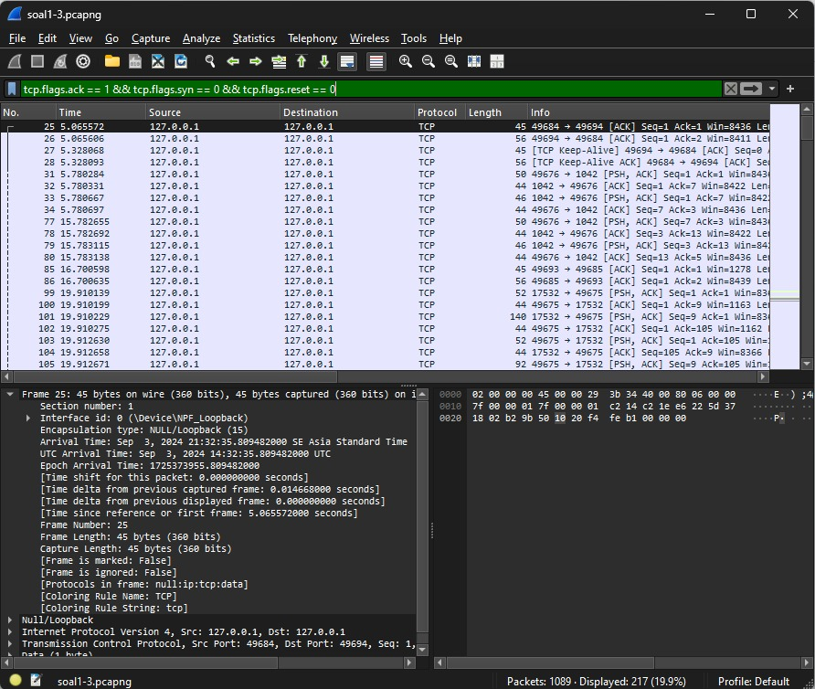
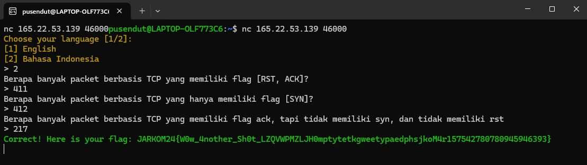

# Jarkom-modul-1-E05-2024

### Kelompok E05:
- Azhar Abiyu Rasendriya H. / 5025211177
- Daffa Diandra Rizky Aghnia / 5025221261

# No. 1
### Soal 
a. Berapa banyak packet yang terekam pada file pcapng?

b. Ada berapa jenis protocol yang terekam pada traffic?

c. sebutkan secara berurutan berdasarkan alfabet menurun dengan koma sebagai separator dan dalam bentuk uppercase, contoh: PROTOCOL1,PROTOCOL2

### Penyelesaian
Untuk mengetahui berapa banyak packet yang terekam pada file pcapng dapat dilihat pada tulisan `Packets:` pada bawah windows wireshark.
  

Untuk mengetahui ada berapa jenis protocol yang terekam pada traffic, kita bisa membuka tabs `statistics` lalu `protocol hierarchy` dan juga tertera jenis protocol maupun sub-protocol yang terekam pada traffic.
  

### Perolehan flag:  
  

# No. 2
### Soal 
a. Berapa banyak packet berbasis TCP yang memiliki flag [RST, ACK]?

b. Berapa banyak packet berbasis TCP yang hanya memiliki flag [SYN]?

c. Berapa banyak packet berbasis TCP yang memiliki flag ack, tapi tidak memiliki syn, dan tidak memiliki rst

### Penyelesaian
Untuk mengetahui berapa banyak packet berbasis TCP yang memiliki flag [RST, ACK] yaitu dengan filter `tcp.flags.reset == 1 && tcp.flags.ack == 1` dan banyaknya packet muncul pada tulisan `displayed` pada bawah windows wireshark.
  

Untuk mengetahui berapa banyak packet berbasis TCP yang hanya memiliki flag [SYN] yaitu dengan filter `tcp.flags.reset == 1 && tcp.flags.ack == 1` dan banyaknya packet muncul pada tulisan `displayed` pada bawah windows wireshark.
  

Untuk mengetahui berapa banyak packet berbasis TCP yang memiliki flag ack, tapi tidak memiliki syn dan tidak memiliki rst, yaitu dengan filter `tcp.flags.ack == 1 && tcp.flags.syn == 0 && tcp.flags.reset == 0` dan banyaknya packet muncul pada tulisan `displayed` pada bawah windows wireshark.
  

### Perolehan flag:  
  
